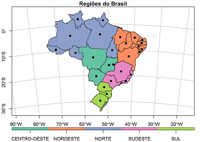

# Análise e visualização de dados espaciais com R

### Walter Humberto Subiza Piña - 2018-2021

email : walter.pina1954@gmail.com

twitter : @humbertosubiza

github:HumbertoSubiza
 
Estes tutoriais, de carater introdutório, estão baseados principalmente nas bibliotecas `sf`, `raster` para análise espacial de dados georreferenciados e algumas especificas para manipulação e visualização desses dados. As _vignettes_ dos pacotes além da documentação mencionada no final de cada tutorial devem consultar-se para aprofundar nos temas expostos.

Os dados para reproduzir os exercicios encontram-se na pasta "/data" e devem ser baixados de [_dropbox_](https://www.dropbox.com/sh/2gmhfx1ycos0ywh/AAAjVB6T6oygAq6nmFQEMUMNa?dl=0). A pasta completa deve estar no seu diretório de trabalho.

Em 25 de agosto de 2018, ficam disponiveis as duas primeiras partes de um total de 4 (mapas_com_R_01 e mapas_com_R_02).

Em 28 de agosto de 2018 ficou disponível a terceira parte de um total de 4 (mapas_com_R_03),

Em 01 de setembro ficou disponível a quarta parte de um total de 4 (mapas_com_R_04), junto com os dois primeiros exercicios de fixação. Dados para reprodução, atualizados no Dropbox.

Em 07 de setembro ficou disponível a ultima parte dos exercicios com um total de cinco.

Em 21 de dezembro foi adicionado uma quinta parte (mapas_com_R_05_RQGIS), referente a integração entre o _R_ e o **QGIS**, permitindo acessar e executar no ambiente _R_, geoalgoritmos de processamento do GIS mencionado e de **GRASS** e **SAGA**.

Em 26 de agosto de 2019 foi atualizada a quinta parte mapas_com_R_05_RQGIS

Em 08 de janeiro de 2021 foi adicionada uma sexta parte referente a geometria de objetos vectoriais em _R_.

Comentários, criticas e sugestões podem ser encaminhados ao email mencionado acima e serão muito apreciados.

---

---

## Indice

---

### **1a. Parte (mapas_com_R_01.rmd)**

#### 1. Introdução

Objetivo: apresentar algumas formas de tratar e visualizar os dados no _R_, considerando sua espacialidade.

Conceito de **feição** ou **_simple feature_**. Apresentação de pacotes `sf`, `raster` e `sp`.

---

#### 2. Objetos classe S-3 e S-4

  a- Definição
        
  b- Representação e geometria vetorial
  
  + Dimensão e coordenadas
      
  + organização das feições simples no `sf`
      
  + Métodos para cada classe
      
  + Tipos de geometria

  c- Dados matriciais ou raster
  
---

#### 3. Sistema Geodésico de Referência - SGR ( _CRS_)

 a- _CRS_ não projetado ou de coordenadas geográficas

 b- _CRS_ de coordenadas projetadas

  Tabelas de SGR no Brasil
  
     Exercício identificação de SGR

---

### **2a. Parte (mapas_com_R_02.rmd)**

#### 1. Leitura de arquivos vetoriais e raster

      Exercícios de identificação de tipo de geometria, SGR, etc
      
  . função `st_read()`:
    
  a- Ponto
  
  b- Linha

  c- Poligono

  d- Multipoligono
  
  e- Raster com uma camada ou _layer_
  
  . função `raster()`
  
  f- raster Multi-camadas ou _multilayers_
  
  . função `brick()`, `stack()`
  
  g- Base de dados PostGis

---

#### 2. Manipulação de dados georreferenciados 

   a- Extração de metadados

  . funções  `extent(), ncell(), nlayers()`
  
   b- Identificação ou definição de um _CRS_ em objetos georreferenciados

  . função `crs(..., asText = TRUE)` para dados matriciais
  
  . função  `st_crs()` para dados vetoriais
  
    Exercício definição do SGR de um arquivo vetorial
  
   c- Reprojetar ou transformar um objeto espacial
   
   . função `sf::st_transform(“dados.shp”, crs)`

   . função ``raster::project_raster(“from.tif”, "to.tif", crs)``
   
    Exercício transformação de SGR
   
   d- conversão de dataframe com coordenadas em objeto “sf” e viceversa
   
   . função `sf::st_as_sf()`

     Exercício conversão objeto dataframe em sf

---

### **3a. Parte (mapas_com_R_03.rmd)**

####  Visualização de dados georreferenciados

  1- Dados vetoriais
  
  + Quadrícula geográfica e projetada
  
  a - Função Base `plot()`
  
  + Cartogramas com a geometria dos objetos (`sfc`)
    
  + Cartogramas usando atributos (dataframe classe `sf`)
  
  b - `ggplot2`
  
  c - `tmap`
  
  2 - Dados matriciais
  
  a - `plot()` e `plotRGB()`
  
  b - Google Maps: `ggmap()` e `qmap()`

---

### **4a. Parte (mapas_com_R_04.rmd)**

#### 1. Análise espacial de dados vetoriais

   a- _Buffer_ : função  `st_buffer(), st_union()`

   b- Áreas envolventes: funções  `st_bbox(), st_make_grid(), st_convex_hull()`

   c- Cálculo de centroides: função  `st_centroid()`.

     Exercício

  d- Área: função `st_area()` (para dados tipo polígono ou multipolígonos)
  
  e- Distâncias: função `st_distance()` (matriz de distâncias entre pontos)
  
  f- Comprimento de feições lineares: função  `st_lenght()` (para dados tipo LINESTRING ou MULTILINESTRING)
  
  g - Adicionar dados georreferenciados e não georreferenciados: função  `merge()`
  
  h- Simplificando poligonos: função  `st_simplify()`
 
---

#### 2. Análisis espacial de dados matriciais ( _raster_) 

   a- reclassificação: função `reclassify()`

    Exercícios

   b- Leitura de valores: função `getValues()`
   

   c- Mudar a resolução: função `aggregate()`

     Exercício

   d- Gravar um arquivo raster: `writeRaster()`
 
--- 

### **5a. Parte (mapas_com_R_05_RQGIS.rmd)**

### Integrando _R_ com QGIS: _RQGIS_

#### 1- Introdução

#### 2- Conceitos básicos do _RQGIS_

#### 3- Uso do RQGIS 

  - set_env()
  
  - open_app()
  
  - find_algorithms()
  
  - get_usage()
  
  - get_args_man()
  
  - run_qgis()

---

### **6a. Parte (mapas_com_R_06_geometrias.rmd)**

### Geometria de objetos espaciais em _R_

#### 1. Criação de geometrias vetoriais, incluindo **geometrycollection**

  - Ponto simples
  
  - Objetos multi-ponto
  
  - Objeto linha 
  
  - Objeto Multilinhas
  
  - Criação de polígono
  
  - Conjunto de geometrias, **geometry_collection** 
 
--- 
  
#### 2. Criar objetos **geometrycollection** a partir de arquivos tipo ESRI e extração dos seus diferentes componentes.

  - Primeiro arquivo
  
  - Simplificando a geometria
  
  - Segundo arquivo
  
  - Criação do objeto **geometry_collection**
  
  - Extração de dados

---

#### 3. Armazenamento de **geometrycollection** em base de dados Postgre/Postgis e importação de um objeto da base de dados para o ambiente _R_.

---

### Exercícios de aplicação

---

#### Análise espacial 01

Objetivo:

Determinar que ruas compõem o bairro de botafogo e estabelecer a que distância se encontram da UPA Botafogo.

 Insumos:
 
  - logradouros municipio RJ (eixo_logra.shp) - [Prefeitura de Rio de Janeiro](http://pgeo3.rio.rj.gov.br/arcgis/rest/services/Cartografia/Vias/MapServer/0)
   
   - bairros do RJ (Botafogo e Urca) (bairros_rj.shp) - Arquivo própio do autor, com limites de alguns bairros de RJ.
   
   - UPA de botafogo (upa_botafogo.shp) - Coordenadas aproximadas da UPA localizada na rua São Clemente do Bairro de Botafogo, RJ.

 Funções empregadas:
 
  - `st_read()`, `st_crs()`,`st_transform()`, `st_geometry()`, `st_intersection()`, `st_intersects()`, `st_contains()`, `st_distance()`.

---

#### Análise espacial 02  

Objetivo:

Analisar o tipo e distribuição de nascimentos no município de RJ entre os anos 2010 e 2015

  Insumos:
  
   - Arquivo nv.csv extraído do [DATASUS](http://www2.datasus.gov.br/DATASUS) em novembro de 2017
   
   - Arquivo camada com os municípios do estado do Rio de Janeiro

Funções empregadas:
 
  - `read_csv()`,`st_read()`, `mutate()`, `merge()`, `readOGR()`, `plot()`, `tmap()`.

---

#### Análise espacial 03

Objetivo:

Calcular a densidade populacional em 2015 para cada município do Brasil.

 Insumos:
 
   - Arquivo camada (.shp) com UF, região e municípios do Brasil (malha_mun_completa.shp)
   
   - populacão estimada por municipio para 2015 (IBGE) (mun_pop_2015.csv)

 Funções empregadas:
 
  - `st_read()`, `st_crs()`,`st_area()`, `drop_units()`, `cbind()`, `filter()`, `st_contains()`, `select()`, `left_join()`, `mutate()`, `read_csv()`.

---

#### Análise espacial 04 

Objetivo:

Efetuar operações  de análise espacial com dados raster

 Insumos:
 
   - Arquivo com modelo de elevações da zona do município de Nova Iguaçú
   
   - Arquivo camada com duas áreas de APA do município de Nova Iguaçú 
   
 Funções empregadas:
 
  - `raster()`, `extent()`,`crop()`, `st_read()`, `st_transform()`, `st_geometry()`, `mask()`, `extract()`.

---

#### Análise espacial 05

 Objetivo:

 Determinar as ruas do municipio de Rio de Janeiro que cruzam com rodovias estaduais ou federais  (localização e número), em um entorno de 200 m das mesmas. A análise final será feita em SGR SIRGAS2000, coordenadas UTM fuso 23 (EPSG = 31983)

 Insumos:
 
    - Rodovias do Brasil levantadas peloa DNIT (rodovias_dnit.shp) - [DNIT](http://www.dnit.gov.br/mapas-multimodais/shapefiles)
   
   - logradouros municipio RJ (eixo_logra.shp) - [Prefeitura de Rio de Janeiro](http://pgeo3.rio.rj.gov.br/arcgis/rest/services/Cartografia/Vias/MapServer/0)

   - malha municipal do Brasil (malha_municipal_brasil.shp) - [IBGE- Estrutura Territorial](https://www.ibge.gov.br/geociencias-novoportal/organizacao-do-territorio/estrutura-territorial/)
   
  - Unidades da federação (Brasil_UF_2013.shp) - [IBGE- Estrutura Territorial](https://www.ibge.gov.br/geociencias-novoportal/organizacao-do-territorio/estrutura-territorial/)

 Funções empregadas:
 
  - `st_read()`, `st_intersects()`,`st_union()`, `st_buffer()`, `st_intersection()`, `st_transform()`, `st_geometry()`.
  
  - `plot()`, `filter()`, `select()`, `str_detect()`, `unique()`, `fct_count()`.

---

CREDITOS: 

  + IBGE - Nocoes Basicas de Cartografia - Manuais Tecnicos em Geociencias, 1999.
  
  +  Edzer Pebesma (2018). sf: Simple Features for R. R package version 0.6-3.
  https://CRAN.R-project.org/package=sf

  +    Robert J. Hijmans (2018). raster: Geographic Data Analysis and
  Modeling. R package version 2.8-4.
  https://CRAN.R-project.org/package=raster

  +   Roger Bivand, Tim Keitt and Barry Rowlingson (2018). rgdal: Bindings for the 'Geospatial' Data
  Abstraction Library. R package version 1.3-4. https://CRAN.R-project.org/package=rgdal
 
  + [EPSG](https://www.epsg-registry.org/) 
  
  +   Hadley Wickham (2017). tidyverse: Easily Install and Load the 'Tidyverse'. R package version
  1.2.1. https://CRAN.R-project.org/package=tidyverse

  + Fonte dos dados: o próprio autor do tutorial ou extraídos do portal IBGE: <https://www.ibge.gov.br/>, e ou mencionados nos próprios exercícios de aplicação.
  
---

