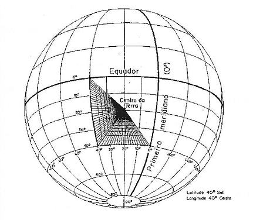
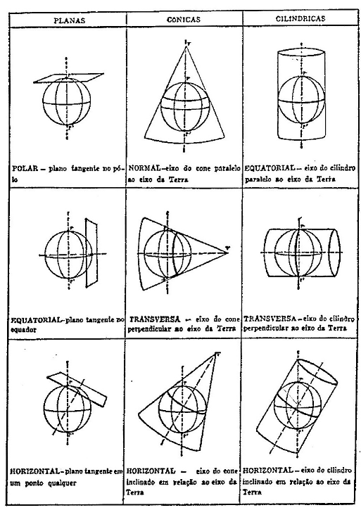

```{r setup, include=FALSE}
knitr::opts_chunk$set(echo      = TRUE, 
                      warning   = FALSE, 
                      message   = FALSE, 
                      fig.path  = paste0(getwd(), "/figuras/"), 
                      fig.ext   = 'png',
                      fig.align = 'center')
```

**El presente curso es una traducción al español del curso ofrecido en 2017 en el IBGE- Rio de Janeiro, Brasil por el autor. Es creación propia y los diversos derechos autorales son mencionados a lo largo de los diversos capítulos.**

### Indice

#### 1. Introducción

Objetivo: presentar las diversas formas de tratar e visualizar los datos georreferenciados en _R_.

Concepto de **_simple feature_**. Presentación de paquetes de funciones, `sf`, `raster` y `sp`.

\

#### 2. Objetos clase S-3 y S-4

  a- Definición
        
  b- Representación y geometria vectorial
  
  + Dimensión y coordenadas
      
  + organización de las **_simple feature_** en `sf`
      
  + Métodos para cada clase
      
  + Tipos de geometria

  c- Datos matriciales o raster
  
\

#### 3. Sistema Geodésico de Referencia - SGR ( _CRS_)

 a- _CRS_ no proyectado o de coordenadas geográficas

 b- _CRS_ de coordenadas proyectadas

  Tablas de SGR en Brasil y Uruguay
  
     Ejercício identificación de SGR

\
---
\

### 1- Introducción

 <div style="text-align:justify" markdown="1">
 
Cuando agregamos información espacial a los datos estadísticos introduzimos un elemento cualitativo importante, tanto en la etapa de análisis, como en la de divulgación de la información y se ha vuelto un tema recurrente en el ámbito del geoprocesamiento y la estadística. Esa tendencia global tambiém se consolida a nível nacional, con por ejemplo lacreación de la Infraestructura de Dados Espaciales de Uruguay - IDEuy. 

La representación espacial se formaliza por medio del concepto **_simple feature_**. Ella está definida en la norma **ISO 19125-1:2004** que describe como los objetos del mundo real pueden ser representados en computadores, enfatizando el aspecto de la geometria espacial. 

A norma estabelece também como esses elementos podem ser armazenados e recuperados de bases de dados e ainda que tipo de operações podem ser efetuadas. Esse padrão é amplamente usado e implementado em bases de dados (como PostGis) e software de  Sistemas de Informação Geográfica – SIG, como QGIS e ArcGis. Uma feição pode ser, por exemplo, uma casa, uma árvore ou uma estrada. Da mesma forma, um conjunto de feições pode-se considerar uma única feição, um conjunto de árvores pode ser uma floresta ou um conjunto de casas, uma vila ou cidade.

Estos documentos, de carácter introductório, tienen como **objetivo presentar las formas de tratar y visualizar los datos en _R_, considerando su geometria y espacialidad **. No tienen la intención de substituir el uso de SIG, principalmente en la elaboración de mapas, cartogramas o análisis complejos, sino demostrar que eas posible manipular y visualizar datos espaciales sin tener que, en ese proceso, hacer el caminho del _R_ al SIG y vice-versa varias veces. Para eso serán presentados dos paquetes específicos: `sf` y `raster`, además de algunos  para visualización. 

Especificamente, el paquete `sf` para datos vectoriais, facilita la leitura y manipulación cuando se le comparado con paquetes anteriores, como el `sp`, ya que los objetos `sf` son dataframes con atributos espaciales y pueden ser manipulados como tales usando paquetes como `tidyverse::dplyr`. Los objetos creados contienen los metadados del SGR y guardan en una única columna los atributos de georrefenciamento. La representación de los objetos es similar al **PostGIS** y todas las funciones comienzan con el prefijo `st_`, en referencia a espacio y tempo, facilitando asíu su búsqueda y uso.

El anterior paquete de manipulación de datos georreferenciados `sp` tiene una larga trayectória en el sistema _R_ y está ampliamente difundido siendo incluído como dependencia en diversos paquetes, ya el paquete `sf` está en fase de desarrollo, pero tiene un futuro muy próspero siendo más simple de usar. De esta forma, esa importante conocer como e realizada la conversión de formato entre los dos paquetes, con la finalidad de aprovechar al máximo los beneficios de ambos.

</div>

La transformación de un objeto `sf` en `sp` y viceversa, puede ser hecha de la seguinte forma:

  1- `sf` en `sp`, usando la función `as`:
  
    objeto_sp <- as(objeto_sf, Class = "Spatial")
  
  2- `sp` en `sf`, usando la función `st_as_sf`:
  
    objeto_sf <- st_as_sf(objeto_sp)
 
 En relación a los datos matriciales o _raster_, el paquete `raster` permite la manipulación y visualización de datos de ese tipo. Vale la pena resaltar la aparición de un nuevo paquete `star`, que tratará todo tipo de datos espacio-temporales, vectoriales y matriciales, en un abordaje del tipo `tidyverse`.

En esta primera parte veremos algunos conceptos teóricos necesarios para entender como se configuran y relacionan los datos con el espacio terrestre.

En los próximos documentos trataremos de:

  . como importar datos vectoriais con o paquete `sf`.
  
  . como importar datos matriciales o _raster_ com una o varias capas, usando el paquete `raster`.
  
  . manipulación y transformación de los datos vectoriais y matriciales.
  
  . grabación de objetos vetoriales o matriciales, con los paquetes `sf` y `raster`.
  
  . algunas funciones de análisis de datos georreferenciados.
  
  . visualización de datos georreferenciados, con os paquetes `plot`, `tmap`, `ggmap`, `ggplot`.
 
\
--- 
\

### 2- Objetos clase S-3 y S-4

---

#### a- Definición

<div style="text-align:justify" markdown="1">

Para entender como los datos espaciales son tratados en _R_, precisamos ver que tipos de sistemas orientados a objeto soporta y en cual de ellos, esos datos se encajan.

El _R_ tiene varias clases de sistemas orientados a objeto, los más usados son S3 y S4, cada uno con su definición, atributos y métodos específicos. 

Cuando es creado un vector, o hacemos la importación de ua tabla, dataframe o lista estamos creando objetos S3. El paquete `sf` define objetos como tipo S-3, facilitando así su manipulación y atributos. Pero específicamente los objetos `sf` son una subclase de la clase `data.frame` y la clase `tbl_df`.

Los objetos de S4, que se utilizan en ráster o datos de ráster, se derivan de S3 y tienen una definición más formal de la clase. En datos espaciales, los paquetes `raster` y `sp` crean objetos de clase 4.

En la siguiente tabla presentamos las principales diferencias entre las clases S-3 y S-4

|Clase S-3             | Clase S-4              |
|-----------------------|-------------------------|
|Sin definición formal| Clase definida con setClass()|
|Objetos creados con atributo de clase|Objetos creados usando new() o co paquetes específicos como `raster`|
|Acceso a atributos con \$|Acceso a atributos con \@ o usando slots()|

</div>

---

#### b- Representación y geometria vectorial

<div style="text-align:justify" markdown="1">

Los objetos del mundo real deben representarse utilizando diferentes tipos de geometría. Toda la geometría se compone de puntos simples de la misma clase, en diferentes espacios dimensionales.
 
Por lo tanto, podemos representar objetos utilizando tres tipos básicos de geometría: **punto, línea y polígono**. Un punto se puede representar en una superficie mediante dos atributos espaciales, X e Y, que son sus coordenadas. Una recta es una sucesión de puntos y un polígono es una sucesión de rectas que no se cortan y cierran en un punto de partida dado. En _R_, es posible combinar en un mismo objeto varias geometrías como puntos, líneas y polígonos, lo que no ocurre en GIS.

Las geometrías mencionadas se representan en un espacio bidimensional. Podemos incluir una tercera y/o una cuarta dimensión, incluyendo atributos como altitudes o tiempo por ejemplo (dimensiones Z o M respectivamente). Así, podemos representar el crecimiento de un árbol a lo largo de su vida utilizando las variables X e Y para dar la ubicación espacial, Z para registrar el crecimiento en altura y M para establecer la fecha de cada medición.

En resumen, un **objeto puede ser representado espacialmente** por un conjunto de coordenadas con las siguientes características:

  - X, Y  - localización espacial (bidimensional)
  
  - X, Y, Z  - localización espacial + altura o altitude (tridimensional)
  
  - X, Y, M  - localización espacial + otra variable medida (tridimensional)
  
  
  - X, Y, Z, M - localización espacial + altura o altitud + otra variable medida (quatridimensional)

---

En el paquete `sf`, los principales tipos de representación geométrica de características simples son:
 
  1- _**POINT**_ : geometría de dimensión cero que contiene un solo punto, representada en una superficie por un par de coordenadas;
  
  2- _**LINESTRING**_: geometría unidimensional compuesta por una secuencia de puntos (_**POINT**_), conectados por líneas que no se cortan;
  
  3- _**POLÍGONO**_: geometría bidimensional de área positiva, formada por una secuencia de anillos de puntos cerrados y no intersecados. El primer anillo será el polígono exterior y los siguientes delimitarán los vacíos interiores, si los hubiere;
  
  4- _**MULTIPUNTO**_: conjunto de puntos, llamado simple si no hay 2 puntos iguales. Cada punto tiene su par de coordenadas;
  
  5- _**MULTISTRING**_: conjunto de _**LINESTRING**_ ;
  
  6- _**MULTIPOLYGON**_: conjunto de _**POLYGON**_;
  
  7- _**GEOMETRYCOLLECTION**_: conjunto de geometrías de cualquier tipo mencionado anteriormente.
  
Hay 10 geometrías especiales más que no serán tratadas en este momento y que se pueden consultar en la documentación del paquete `sf`.

El almacenamiento de objetos se realiza de la siguiente manera:

  + el **objeto `sf`**, clase 3, tiene las siguientes propiedades:
  
    1- un tipo de geometría (algunas de las mencionadas anteriormente),
    
    2- un tamaño (número de características y atributos),
    
    3- una extensión espacial ( _bounding box_ o _bbox_), y una
    
    4- _CRS_ (que puede ser desconocido, es decir, _NA_).

  + los atributos de las características se almacenan en un objeto de tipo `dataframe`, llamado clase `sf`, que debe contener las siguientes dos clases:
  
   1- objeto de la clase `sfc`. Debido a que la geometría puede tener múltiples valores, se almacena en una sola columna que contiene objetos de tipo "lista". Esta columna tiene el mismo tamaño que el número de registros (filas) en el `marco de datos`;
  
    2- Objeto de la clase `sfg`. La geometría de cada función se almacena en un objeto `lista`, contenido dentro del objeto `sfc`.
  
La siguiente figura muestra cómo se organiza un objeto de esta clase `sf`. El encabezado indica el número de características y atributos, el tipo y tamaño de la geometría, la extensión espacial y el CRS. En amarillo, se resalta el marco de datos (clase `sf`), en verde la geometría (en una columna de tipo lista, clase `sfc`) y en rojo la geometría de una característica (en este caso, el tercer registro, clase `sfg` ).

El objeto figura es un archivo multipolígono que contiene 6 entidades con tres variables cada una. Los 6 registros corresponden a los límites de algunos municipios de RJ y las tres variables son: un identificador, el geocódigo del municipio y su nombre.

 Cada clase mencionada tiene sus propios métodos, para ver la lista completa de ellos, ejecute `methods(class="sf")`. Explore los métodos de las otras dos clases, `sfc` y `sfg`.
 
 </div>
  
 <div style="text-align:center" markdown="1">


</div>
 
---

<div style="text-align:justify" markdown="1">

#### c- Datos matriciales o _raster_

Un archivo _raster_ es una estructura de datos que divide el espacio en porciones rectangulares iguales llamadas celdas o _pixels_, las cuales pueden almacenar uno o más valores en cada celda. Esta estructura también se conoce como **grid** o **cuadrícula**, a diferencia de los datos de tipo vectorial ya vistos.

El paquete `raster` tiene funciones para leer, manipular y grabar datos raster de una manera muy eficiente, ya que no necesita cargar los datos en memoria para realizar las operaciones mencionadas. Esto se vuelve relevante ya que normalmente los datos raster son de gran volumen. Los objetos creados con este paquete son de clase S-4.

El paquete `raster` te permite importar 3 tipos de objetos. Básicamente todos ellos almacenan los siguientes atributos o _slots_:

    - el número de columnas y filas,
    
    - las coordenadas de la extensión espacial (un objeto de la clase "extensión") y
    
    - el SGR (objeto de clase "proj.4" además del código EPSG, si está disponible).

El _raster_ también puede almacenar los valores específicos de cada celda y variable (capa). **Importante: Las coordenadas se refieren a los extremos de la cuadrícula (esquinas) y no al centro de cada celda como lo hacen algunos software GIS.**

Los tres tipos de objetos raster son:

  + `RasterLayer`, representa una sola capa de datos. Un ejemplo podría ser un modelo de elevación digital (DEM) o temperaturas superficiales producidas por una red de estaciones meteorológicas;
  
  + `RasterBrick`, utilizado para representar más de una variable o capa (_multicapa_), pero pertenecientes a un único archivo. Un ejemplo típico es una imagen de satélite multiespectral; Es
  
  + `RasterStack`, para la representación de más de una variable, que pueden pertenecer a diferentes archivos oa una combinación de algunas capas de un solo archivo. Es obligatorio que los límites espaciales y la resolución de todas las capas sean iguales.

La forma más sencilla de crear un objeto _raster_ es leyendo un archivo. El paquete permite leer los formatos más comunes como GeoTIFF, ERDAS, ESRI, ENVI, etc, utilizando la biblioteca `rgdal`. Dependiendo del tipo de archivo que importemos, se utilizarán las funciones `raster()`, `brick()` o `stack()`.

</div>

---

<div style="text-align:justify" markdown="1">

### 3- Sistema Geodésico de Referencia – SGR ( _CRS_)

Cuando hablamos de datos georreferenciados o espaciales, estamos diciendo que tienen un atributo que los relaciona con la superficie terrestre, este atributo es la geometría tal como se define en el título anterior. La relación con la superficie terrestre se establece por medio de coordenadas, las cuales pertenecen a un **Sistema de Referencia Geodésico – SGR**. En _R_, el SGR se denomina **_Sistema de Referencia de Coordenadas – CRS_**.

Los elementos que componen un _SRC_ son: un **modelo de la Tierra**, un **sistema de coordenadas** y un **punto de origen del terreno**, donde se posiciona el origen de nuestro sistema de coordenadas.

En cuanto al **modelo de la Tierra**, se utilizan principalmente dos modelos: el **esférico** y el **elipsoide**. Este último tiene una aproximación más cercana a la forma real de la Tierra, ya que se definen dos ejes del elipsoide de diferentes tamaños, y así es posible modelar el achatamiento existente en los polos (el radio polar es aproximadamente 11,5 km más pequeño que el ecuatorial). En algunas aplicaciones cartográficas no hay diferencia en el uso de cualquiera de estos modelos.

Los **sistemas de coordenadas** pueden ser de tipo **geográfico** (definidos por latitud y longitud) o **proyectados** (ejes Este y Norte, o ejes X e Y). La elección determina cómo se dividen los ejes del modelo de la Tierra y las unidades de medida. Mientras que las unidades de los sistemas geográficos son angulares y se miden en grados, las de los sistemas proyectados son lineales y se miden en metros (m).

**Punto de origen terrestre**, este punto determina el origen de escala de nuestros ejes de coordenadas. Anteriormente se definía en la superficie terrestre mediante medidas astronómicas (sistema local). Actualmente, los sistemas de referencia tienen su origen en el geocentro, definido mediante técnicas de posicionamiento satelital (sistemas globales).

Los elementos definitorios mencionados: **modelo de la tierra, punto de origen terrestre y sistema de coordenadas**, caracterizan cada SGR. En particular, la elección de los elementos: modelo terrestre y punto de origen terrestre se denomina _Datum_. _Datum_ SIRGAS2000, por ejemplo, tiene como modelo terrestre el elipsoide GRS80 y como punto de partida el geocentro terrestre. En este _Datum_ podemos optar por trabajar con sistemas de coordenadas geográficas o un sistema de coordenadas proyectadas, como el _Universal Transverse Mercator - UTM_ para la ubicación de las características.

<div/>

\
---
\

<div style="text-align:justify" markdown="1">

#### a- _CRS_ no proyectado o de coordenadas geográficas

Al definir el sistema, vimos que se elige un elipsoide específico (SIRGAS, WGS84, Internacional, etc.), un punto de origen (actualmente el geocentro) y un sistema de coordenadas. En cuanto a las coordenadas geográficas, **latitud** y **longitud** se utilizan para la ubicación espacial de los objetos. La **latitud** es la distancia angular desde el paralelo 0º, o Ecuador, contada hacia el Polo Sur (latitud -90º) o hacia el Polo Norte (latitud +90º). La **longitud** es la distancia angular desde el meridiano 0º, o meridiano de Greenwich, contada hacia el este (longitudes de 0º a 360º) o hacia el este y el oeste (longitudes de 0º a +180º y de 0º a -180º, respectivamente). Estas unidades de medida están en grados sexagesimales. En la figura, un sistema de coordenadas geográficas que muestra la ubicación de un punto de coordenadas con longitud y latitud de -40 grados (Fuente: IBGE).

<div/>

<div style="text-align:center" markdown="1">




<div/>

---

#### b- _CRS_ de coordenadas proyectadas

Los sistemas de referencia con coordenadas planas o proyectadas suponen la proyección de coordenadas geográficas sobre una superficie plana y el uso de ejes cartesianos X e Y, con una escala métrica y un origen determinado. Todos los sistemas diseñados provienen de algún sistema geográfico existente.

Para pasar de un sistema de coordenadas geográficas a un sistema de coordenadas proyectadas, necesitamos una superficie que tenga la posibilidad de desarrollarse en el plano. Así, tenemos proyecciones que utilizan superficies cónicas, cilíndricas o planas. Para regiones ubicadas en latitudes medias, las superficies cónicas con uno o dos meridianos de contacto son las más adecuadas, mientras que para la cartografía global, las proyecciones cilíndricas son las mejores. En cuanto a los polos, podemos utilizar una superficie plana, tangente al propio polo.

Los sistemas diseñados tratan de minimizar la deformación producida en la transformación. De esta forma, algunos conservan cierta geometría, como el área, la dirección, las distancias o la forma misma de los objetos en detrimento de otros. **¡No hay proyección que esté libre de deformaciones, ya sea en dirección, área o forma de las características!** La siguiente figura (Fuente: IBGE) muestra algunos de los sistemas de proyección mas utilizados.


<div style="text-align:center" markdown="1">



<div/>

---

<div style="text-align:justify" markdown="1">

La biblioteca **_GDAL (Geospatial Data Abstraction Library)_** es una biblioteca de licencia abierta de software informático para leer y escribir datos geoespaciales, siguiendo el estándar ISO mencionado en la introducción.

La descripción de un _CRS_ geográfico se da a través de un texto en formato `proj4string`, que define los parámetros de cada sistema y es utilizado por la librería `PROJ.4`.

Los sistemas geodésicos de referencia proyectados se definen a través de las especificaciones contenidas en el documento **_EPSG Geodetic Parameter dataset_** de la **_International Association of Oil & Gas Producers - IOGP_**. Ambas bibliotecas se implementan en _R_ a través de la biblioteca `rgdal`.

En los archivos vectoriales de capa o _shape_ existen varios archivos que definen la geometría y características de los datos. Específicamente, el archivo `.prj` de cada `shape` contiene las especificaciones _CRS_. En _R_ hay varias formas de definir un SGR, puede ser a través de su número EPSG, en el formato `proj.4` o en el formato _Well Known Text - WKT_. Los siguientes ejemplos están en formato _WKT_, con la letra en negrita que muestra los argumentos de definición:
<div/>

---


##### _CRS_ no proyectado o de coordenadas geográficas


**GEOGCS**["SIRGAS 2000",

**DATUM** ["D_SIRGAS_2000", 

**SPHEROID**["GRS_1980", 6378137, 298.257222101]], 

**PRIMEM**["Greenwich",0], 

**UNIT**["Degree", 0.017453292519943295]]

---


##### _CRS_ con coordenadas projetadas


**PROJCS**["SIRGAS_2000_UTM_zone_24S", 

**GEOGCS**["GCS_SIRGAS 2000", 

**DATUM**["D_SIRGAS_2000", 

**SPHEROID**["GRS_1980",6378137,298.257222101]], 

**PRIMEM**["Greenwich",0],UNIT["Degree",0.017453292519943295]],

**PROJECTION**["Transverse_Mercator"], 

**PARAMETER**["latitude_of_origin", 0], 

**PARAMETER**["central_meridian", -39],

**PARAMETER**["scale_factor", 0.9996], 

**PARAMETER**["false_easting", 500000], 

**PARAMETER**["false_northing",10000000],

**UNIT**["Meter", 1]]

---

<div style="text-align:justify" markdown="1">

Para los datos raster, la misma información puede estar en un archivo separado o incluirse en el encabezado del propio archivo, junto con los datos.

Las siguientes tablas resumen las principales SGR, con coordenadas geográficas y proyectadas, que podemos encontrar en Uruguay.

<div/>

---

#### Sistemas Geodésicos de Referência, coordenadas geográficas

---

```{r tabela01, echo=FALSE}
CRS_geo <- tibble::tribble(
             ~Nombre, ~"código EPSG", ~"Definición formato Proj.4",  ~Observaciones,
  "Yacaré",    4309, "“+proj=longlat +ellps=intl +towgs84=-124.45,183.74,44.64,-0.4384,0.5446,-0.9706,-2.1365 +no_defs +type=crs”",    "Obsoleto",
           "SIRGAS-ROU98",    5380,                             "“+proj=longlat +ellps=WGS84 +no_defs +type=crs”",     "Oficial"
  )

require(knitr)
require(kableExtra)
kable_styling(
              kable(CRS_geo, digits = 3, row.names = FALSE, align = "c",
              caption = NULL, format = "html"),
        bootstrap_options = c("striped", "hover", "condensed"),
        position = "center", full_width = FALSE) 
```

---

#### Sistemas Geodésicos de Referencia, _Datum_ SIRGAS2000 - coordenadas proyectadas en sistema UTM

---

```{r tabela02, echo=FALSE}
CRS_UTM <- tibble::tribble(
      ~Nombre, ~"código EPSG", ~"Definición formato Proj.4",    ~Observaciones,
  "SIRGAS-ROU98 / UTM-21S",   5382, "“+proj=utm +zone=21 +south +ellps=WGS84 +towgs84=0,0,0,0,0,0,0 +units=m +no_defs +type=crs”",   "Huso 21 Sur",
  "SIRGAS-ROU98 / UTM-22S",   5083, "“+proj=utm +zone=22 +south +ellps=WGS84 +towgs84=0,0,0,0,0,0,0 +units=m +no_defs +type=crs”",   "Huso 22 Sur"
  )

require(knitr)
require(kableExtra)
kable_styling(
              kable(CRS_UTM, digits = 3, row.names = FALSE, align = "c",
              caption = NULL, format = "html"),
        bootstrap_options = c("striped", "hover", "condensed"),
        position = "center", full_width = FALSE) 
```

---

<div style="text-align:justify" markdown="1">

Si necesitamos un _CRS_ de otro país, podemos consultar la web [EPSG](epsg.io) y elegir el que queremos. Todavía tenemos la posibilidad de exportar el _CRS_ en formato **WKT** o **Proj.4**. Sin embargo, existe la posibilidad de que un sistema de coordenadas proyectadas no tenga un código EPSG, es el caso de sistemas creados localmente y no globalmente
<div/>

#### Exercicio 01

Disponemos de datos antiguos de Mozambique en coordenadas proyectadas y datum Tete. Busque en la página de la EPSG el CRS correspondiente y responda las siguientes preguntas:

    - ¿Cuál es la unidad de medida?
  
    - ¿Qué elipsoide usó?
  
    - ¿Qué autoridad es responsable del SGR?
  
Exporte el CRS en formato **WTK** y **Proj.4**.

\
---
\

FIN primera parte

---

CREDITOS: 

  + IBGE - Nocoes Basicas de Cartografia - Manuais Tecnicos em Geociencias, 1999.
  
  +  Edzer Pebesma (2018). sf: Simple Features for R. R package version 0.6-3.
  https://CRAN.R-project.org/package=sf

  +  Robert J. Hijmans (2017). raster: Geographic Data Analysis and Modeling. R package version
  2.6-7. https://CRAN.R-project.org/package=raster

  +   Roger Bivand, Tim Keitt and Barry Rowlingson (2018). rgdal: Bindings for the 'Geospatial' Data
  Abstraction Library. R package version 1.3-4. https://CRAN.R-project.org/package=rgdal
 
  + [EPSG](https://epsg.io/) 
  
---